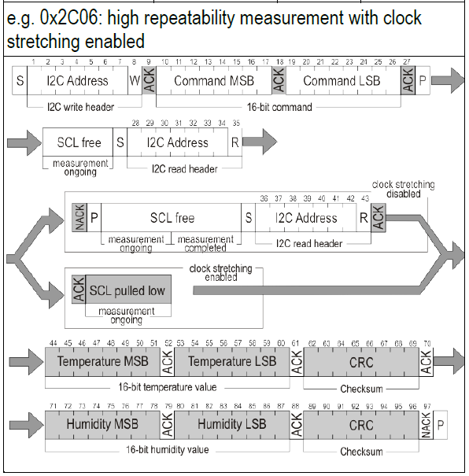
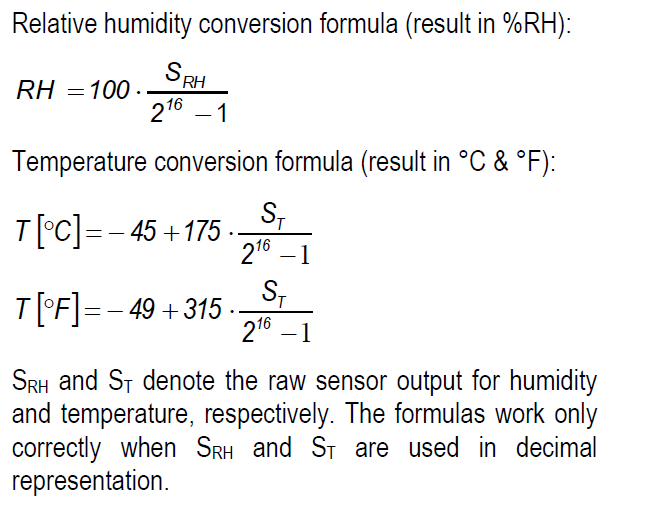
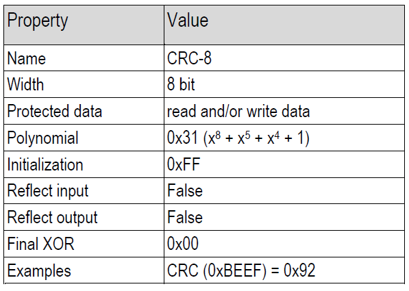

# DHT30 sensor on Pi pico W with report to Domoticz using Micropython

---

## Description

This project utilizes a Raspberry Pi Pico-W for accessing Adafruit’s DHT30 sensor for temperature and relative humidity data, and sending that to a local instance of Domoticz. All code is in Micropython. Even though Adafruit’s Circuitpython has excellent support for the DHT30, I found it to be a little overkill for a small project like this. Moreover the support for Wifi was at the time of development not yet robust.

The code is deliberately kept simple, using only what is required to get reliable repeated measurement with lw frequency. Extending from this point should be straightforward. The documentation is a little extensive so it is understandable for anyone without much prior knowledge.

## Installation

Download the Python files, run them through e.g. Thonny on a second Raspberry Pi on your pico. Flash them to the pico as you would for any other piece of Micropython code, and that should be it.

## Usage

Use examples liberally, and show the expected output if you can. It's helpful to have inline the smallest example of usage that you can demonstrate, while providing links to more sophisticated examples if they are too long to reasonably include in the README.

## SHT30 Technical background

To fully understand the SHT30 search for the Sensiron SHT3x-DIS [documentation](https://eu.mouser.com/pdfdocs/SHT3x-DIS.pdf) (The manufacturer may have moved the file location). For our purpose we only need the command syntax for a few commands, notably making and sending a single measurement. The documentation lists many more. Once you know  the principle, then using any of the other commands is straightforward.

The manufacturers documentation indicates that sending 0x2C06 will trigger the sensor toe perform a measurement. The i2c address is standard 0x44 for the DHT30. Ignore the 'high repeatability with clock stretching' for this simple case. Once the measurement is completed, the sensor will return 6 bytes, two data-bytes and a crc-byte for the temperature, followed by two data-bytes and crc-byte for the relative humidity.



Assuming no data corruption the temperature and relative humidity can be decoded from the received bytes using the following formula's.



In general it makes sense to check if the computed checksum matches the transferred crc-byte. See code example below on how that is done. The manufacturer's specification is as follows:



## The i2c bus on the picoW

The PicoW and the Pico both have two hardware i2c buses. The default frequency of communication over the bus, as set in Micropython, is 400kHz. The sensor supports even higher speeds. This requires good and short wires. In my case I needed to extend the wire between the sensor and the Pico and this required lowering the default frequency to about 10kHz to get reliable communication over the bus. In principle this could handicap other devices on the same bus. In this example the DHT30 is the only device on the i2c-bus, and we can freely choose the frequency.

Assignment of GPIO pins to the data (sda) and clock (clk) lines can be done with calls to Micropython's 'machine' module.

## Example code for communicating with the DHT30

If you want to get started and check whether everything is wired up correctly, it should suffice to copy paste the code below and check you get a return, albeit gibbrisch without decoding, from the DHT30. We use pins 16 and 17 for i2cbus 0, but it should work with suitable pair (check the pico pinning documentation) of i2cbus pins.

```
import time
from machine import Pin, I2C, 

sdaPIN = Pin(16)
sclPIN = Pin(17)

# sda_gpio16 and scl_gpio17 are linked to i2c-bus 0
i2cbus = 0        
i2c    = I2C(i2cbus,sda=sdaPIN, scl=sclPIN, freq=10000)

# send break and reset to start with clean state
# 0x44 is address of Adafruit's DHT30
  
i2c.writeto(0x44,b'\x30\x93')
time.sleep_ms(10)
i2c.writeto(0x44,b'\x30\xA2')
time.sleep_ms(10)

while True:
    # single measurement with high repeatability
    i2c.writeto(0x44,b'\x2C\x06') 
    time.sleep_ms(10)
    # DHT30 will send 6 bytes as reply
    data = i2c.readfrom(0x44,6)
    time.sleep(1)
    # Without decoding the following will print gibberish,  
    # but it proves correct bus-communication
    print(data) 
```

Once you are happy the communication between the pico and the DHT30 works as expected it is time to extract the data. Using the conversion formula’s above we can replace the print(data) statement with:

```
    temp = round((((data[0] << 8 |  data[1]) * 175) / 0xFFFF) - 45,1)
    hum = round(((data[3] << 8 | data[4]) * 100.0) / 0xFFFF,1)
    print(temp, hum)
```

This should get you the temperature in Celsius and the relative humidity in %

We have ignored any possible data corruption to this point.(@@@convert to stand-alone)

```
    def check_crc(raw_data) -> None:
        checksum = True
        for i in range(2):
            data = raw_data[i*3:i*3 + 3]
            crc = 0xFF        
            for b in data[:-1]:
                crc ^= b;
                for _ in range(8, 0, -1):
                    if crc & 0x80:
                        crc = (crc << 1) ^ 0x131;
                    else:
                        crc <<= 1
            if data[-1] != crc:
                self.checksum = False
                break
```

## Support

Raise an issue if you have any questions or suggestions.

## Roadmap

There appear to be no obvious extensions to this simple functionality, hence there is no roadmap. But raise an issue if you think this can be pushed further.

## Credits

[R.Sanchez](https://github.com/rsc1975/micropython-sht30/blob/master/sht30.py) wrote some code for a totally different, and now obsolete(?), board that proved a useful reference. If anything it was a clear indication that a simple approach with Micropython was possible. In fact for the Pico it required even less code to communicate with the DHT30.

## License

For open source projects, say how it is licensed.

## Project status

If you have run out of energy or time for your project, put a note at the top of the README saying that development has slowed down or stopped completely. Someone may choose to fork your project or volunteer to step in as a maintainer or owner, allowing your project to keep going. You can also make an explicit request for maintainers.